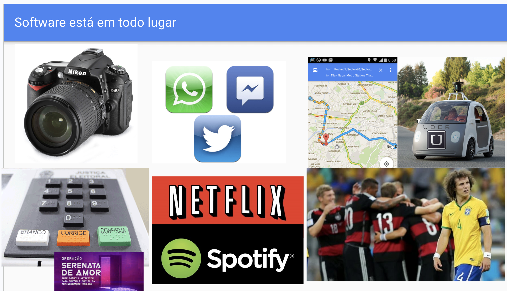

{::nomarkdown}
template: inverse



---
template: inverse

# Motivação

Bem-vindo ao curso de Introdução à Lógica de Programação com Python! 

---

## Por que aprender Programação?

Programação é como dar instruções precisas a um GPS: 
algoritmos guiam soluções eficientes para problemas complexos, dos apps à IA. 
Python simplifica isso com sintaxe clara, usada por Google, NASA e startups brasileiras. 

Você poderá criar jogos, analisar dados e automatizar tarefas.

---

---

## Aplicações no Mundo Real

- **Ciência de Dados**: Analise dados do ENEM ou clima em Salvador.
- **Web e Apps**: Sites interativos ou bots no WhatsApp.
- **IA e Robótica**: Modelos como ChatGPT ou controle de drones.

Python domina 70% dos empregos em programação no Brasil, abrindo portas em TI, finanças e pesquisa.

---

## O Que Você Vai Aprender

- **Fundamentos**: Variáveis, comandos, estruturas de controle e de dados.
- **Algoritmos**: Cálculos, busca, ordenação, entre outros.
- **Programação em Python**.

--- 
## Por Que Python é Perfeita para Iniciantes

Sintaxe simples como português: `print("Olá, Salvador!")` roda instantaneamente. 
Comunidade ativa em fóruns brasileiros e ferramentas gratuitas.

--- 
## Plano do Curso

- **Aulas Semanais**: Teoria + coding ao vivo + exercícios.
- **Avaliação**: Listas de exercícios no Jude, exercícios em sala e Provas.
- **Ferramentas**: Python Tutor e JUDE.

---

# Apresentação do curso

---
## Objetivos

Reunir pessoas para:

- Resolver problemas através de programas (raciocínio computacional).
- Aprender a construir programas de computador.
- Escrever pequenos programas de computador na linguagem Python.

---

## Por que aprender a programar?

- Automatizar tarefas
- Gerenciar informação
- Para participar ativamente da Sociedade da Informação.

> Porque é divertido.
---

## Automatizar tarefas

- Renomear arquivos de foto para ficar no padrão ano-mês-dia
- Internet das coisas; automação residencial
- Carros autônomos

---

## Gerenciar informação

- Sistemas de informação em geral (gerenciador de eventos, lojas virtuais etc.)
- Aplicativos móveis

--- 

## Pra que aprender a programar?

- Se existe um programa pronto, eu posso usá-lo
- Se existe um programa parecido, talvez eu possa modificá-lo
- Se não existe, posso criá-lo (programá-lo).

---

## Aplicações no Mundo Real

- **Ciência de Dados**: Analise dados do ENEM ou clima em Salvador.
- **Web e Apps**: Sites interativos ou bots no WhatsApp.
- **IA e Robótica**: Modelos como ChatGPT ou controle de drones.

---
 
## Por Que Python é Perfeita para Iniciantes?

- Sintaxe simples como português: `print("Olá, Salvador!")`.
- Comunidade ativa em fóruns brasileiros e ferramentas gratuitas.

- Python domina 70% dos empregos em programação no Brasil, abrindo portas em TI, finanças e pesquisa.
- Python é usada por Google, NASA e startups brasileiras.

--- 

## Ementa

Introdução aos princípios de programação.
desenvolvimento de algoritmos, 
refinamento sucessivo, noções de especificação e correção de algoritmos. 
Construção de programas aplicando conceitos de linguagens de programação: 
variáveis, constantes, operadores aritméticos e expressões, estruturas de controle 
(atribuição, sequência, seleção, repetição, recursão). 
Parâmetros e princípios de programação estruturada e modular. 
Documentação de programas. Teste de programas. Análise de resultados.

---

## Metodologia

- Uso da linguagem de programação Python
- Uso da plataforma JUDE
   - Exercícios com correção automática
- Aulas práticas e teóricas
- Exercícios em laboratório

## Avaliações

- Listas de exercícios de programação (15% total)
- Três Provas (pesos 15%, 20%, 25%)
- Projeto final (peso 25%)

- Frequência às aulas

---

## Código de conduta

- Respeito
- Dedicação ao curso
- Realização efetiva das tarefas, sem cópias ou uso inadequado de ferramentas de IA.

---

# Leituras

- Allen B. Downey.  (2ª ed.). Disponível em https://penseallen.github.io/PensePython2e/
- Tradução do livro How to Think Like a Computer Scientist: Interactive Version.
Copyright (C) Brad Miller, David Ranum, Jeffrey Elkner, Peter Wentworth, Allen B. Downey, Chris Meyers, and Dario Mitchell. Disponível em https://panda.ime.usp.br/pensepy/static/pensepy/

{:/}
