{::nomarkdown}
template: inverse

# Estruturas de Repetição 



---
template: inverse

# Estrutura `while`

---
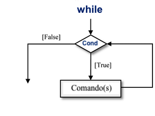

---
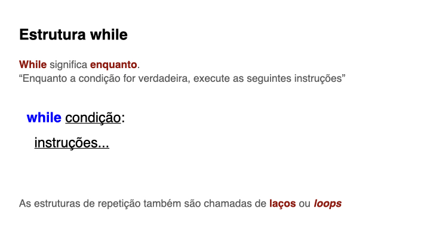

---
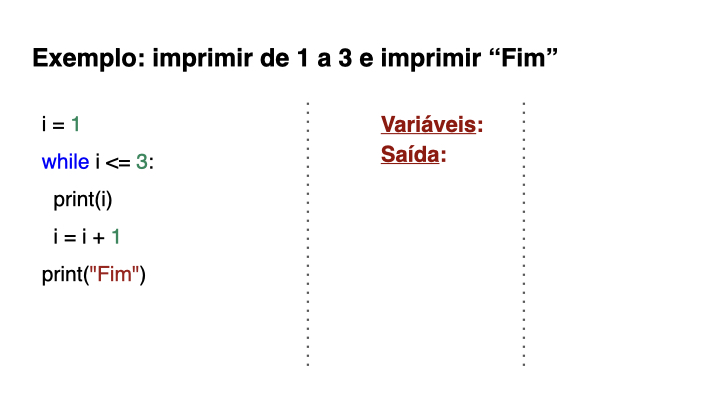

---
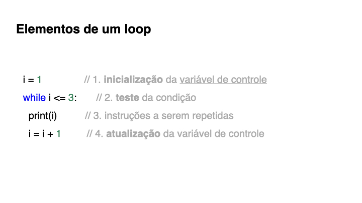

---
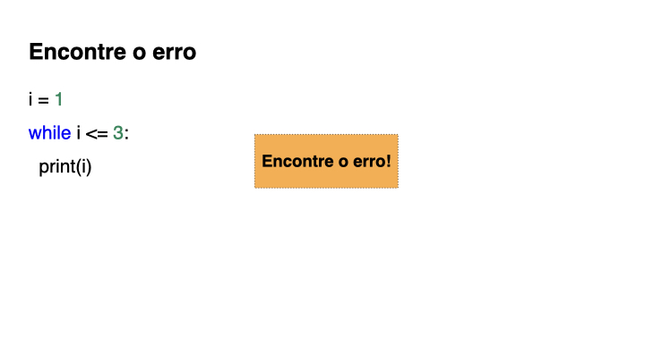

---
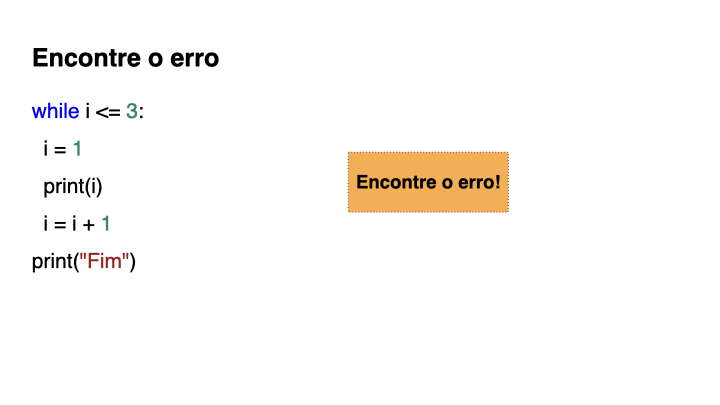

---
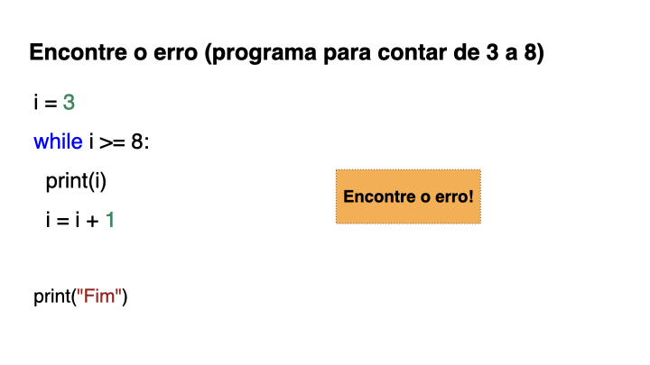

---
# Exercícios

(1) Escrever "eu sei programar" 5 vezes.

(2) Escrever a sequência 0,2,4,6,8,10.

(3) Escrever a sequência 9,6,3,0,-3,-6,-9

(4) Escrever a sequência 1,2,4,8,16,32,64

(5) Escrever a sequência 1,2,3,4,1,2,3,4,1,2,3,4

(6) Escrever a sequência 1,2,3,4,4,3,2,1

---
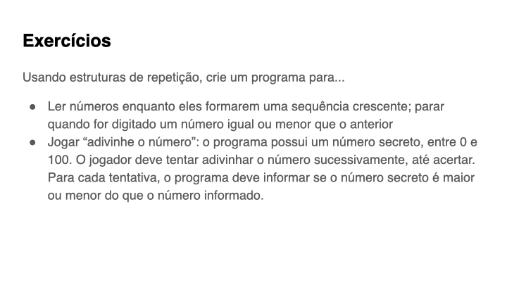

---
template: inverse
## Dicas para correção automática

---
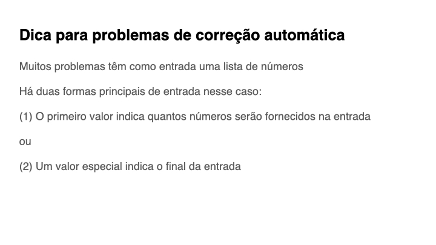

---
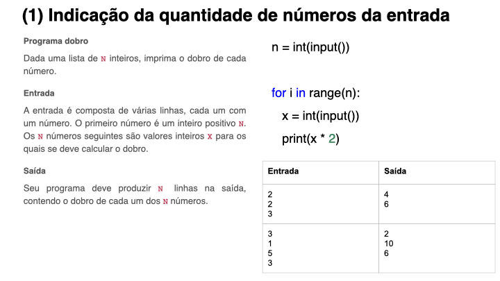

---
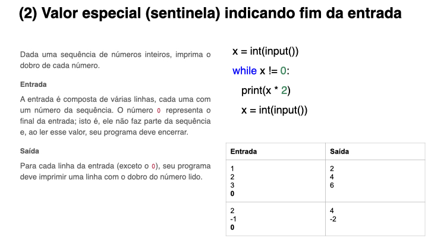

{:/}

