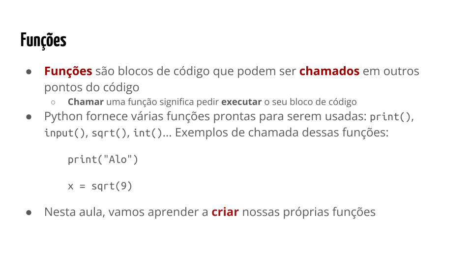

{::nomarkdown}
template: inverse

# Funções em Python



---

---
## Funções simples 

---

---
## Funções com parâmetros

---

---

---
## Funções que retornam um valor

---

---

## Outros exemplos

---

---

---

## Variáveis locais

`Variáveis locais` a uma função são
as variáveis definidas no corpo de tal função 
e só podem ser acessadas pelo código interno à função.

[Rode o exemplo](https://pythontutor.com/visualize.html).

---

## Variáveis globais

`Variáveis globais` de um programa são aquelas definidas fora de todas as funções.
- O valor de uma variável global pode ser acessado dentro do corpo de qualquer função.

---

## Variáveis globais

O valor de uma variável global `não pode ser modificado` em uma função Python,
exceto se a mesma for declarada como `global` no corpo da função.

[Rode o exemplo](https://pythontutor.com/visualize.html).

---

## Sobre o uso de variáveis globais

Usar variáveis globais é muitas vezes considerado **má prática de programação**.

- Em geral, recomenda-se passar valores como parâmetros e receber valores como retorno da função.

Se `uma função não usa variáveis globais`, 
a chamada da função contém as informações necessárias 
para tratá-la como módulo independente e `caixa-preta` (black box).

Se `uma função usa variáveis globais`, 
é necessário conhecer melhor a função, as variáveis globais que ela usa 
e as que pode alterar.

{:/}

