{::nomarkdown}
template: inverse

# Funções em Python



---
## Funções

Funções são blocos de código que podem ser chamados em outros pontos do programa. 
A `chamada de função` (_function call_) é uma instrução composta 
pelo nome da função seguido de uma lista de argumentos entre parênteses.

- A partir da chamada de uma função, a execução prossegue no primeiro comando
de seu bloco de código.

- Na chamada de função, pode-se passar `argumentos` para uso durante sua execução,
 podendo ser qualquer tipo de expressão, inclusive chamadas de função.

- Dentro da função, os argumentos são atribuídos a variáveis chamadas `parâmetros`.

- Ao final de sua execução, a função pode retornar um valor
e o controle retorna para o `chamador` (_caller_).

---
## Exemplo

Python fornece várias funções prontas para serem usadas: 
type(), input(), len(), int()... 

```python
>>> type(100)
<class 'int'>
```

- O nome da função é `type`
- A expressão entre parênteses é chamada de `argumento da função`. 
- Para esta função, o resultado é o tipo do argumento.

---
## Chamada de funções

```python
>>> x = math.sqrt(9) // requer módulo math
>>> len([0,1,2,3,4])
>>> int(2.0)
```

- Módulos são coleções de funções que podem ser `importados`

```python
import random

random.randint(0, 60) 
```

---
## Função definida pelo programador

```python
def <nome> (<0 ou mais parâmetros>): 
    <corpo da função>
    return <valor>
```
---

## Exemplos 

### Programa (sem funções)

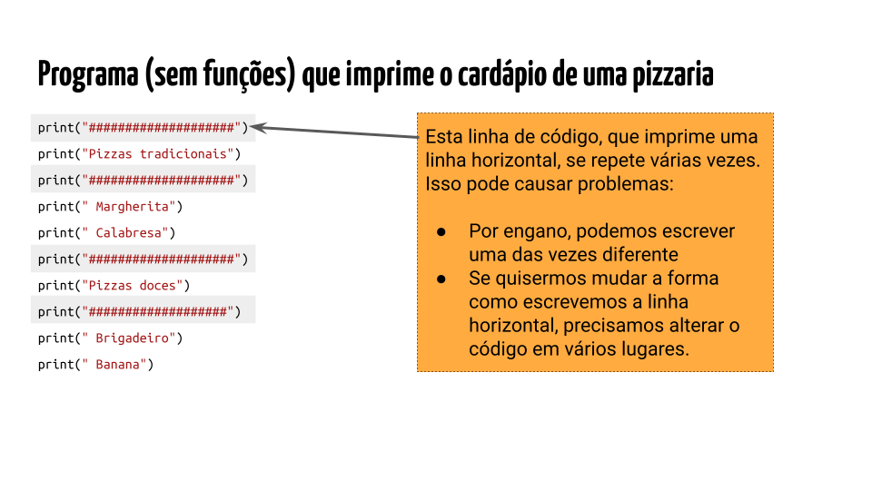

---
### Função definida pelo programador

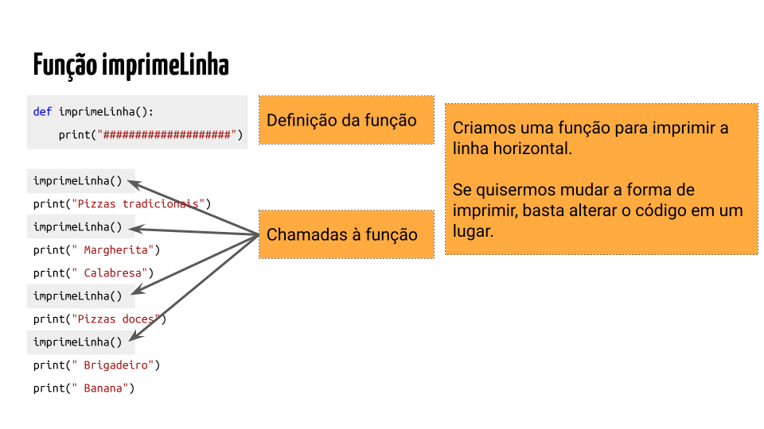

---
## Funções com parâmetros

- Impressão do título pode ser definida como função.
- Nome da seção do cardápio pode ser passado na chamada da função.

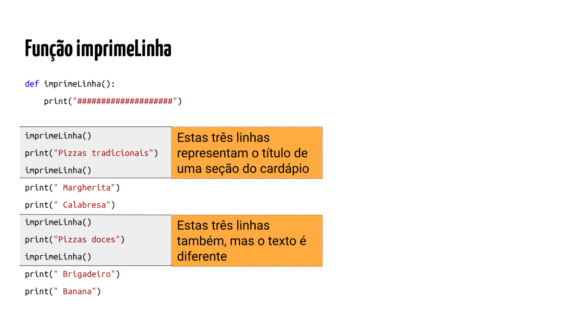

---
## Função imprimeTitulo(texto)

- O parâmetro é `texto`.

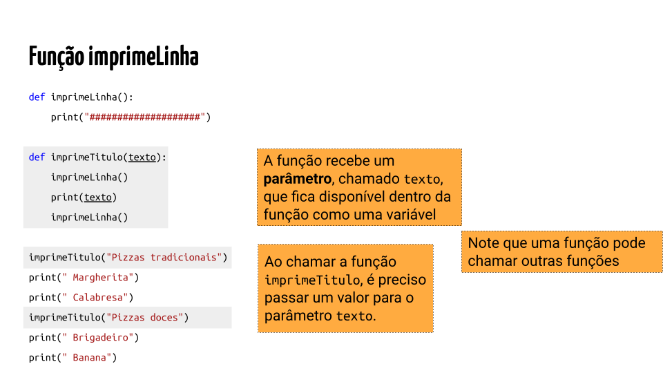

---
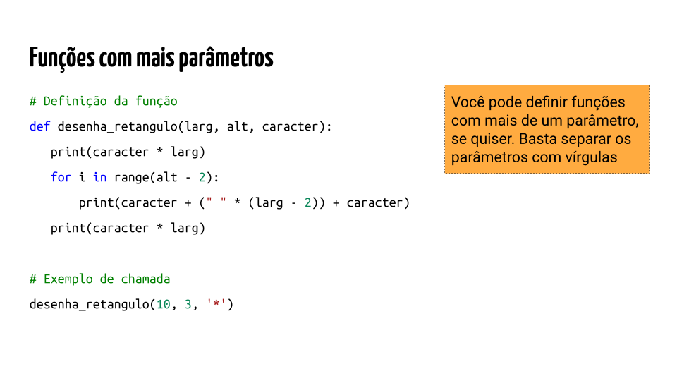

---
## Funções que retornam um valor

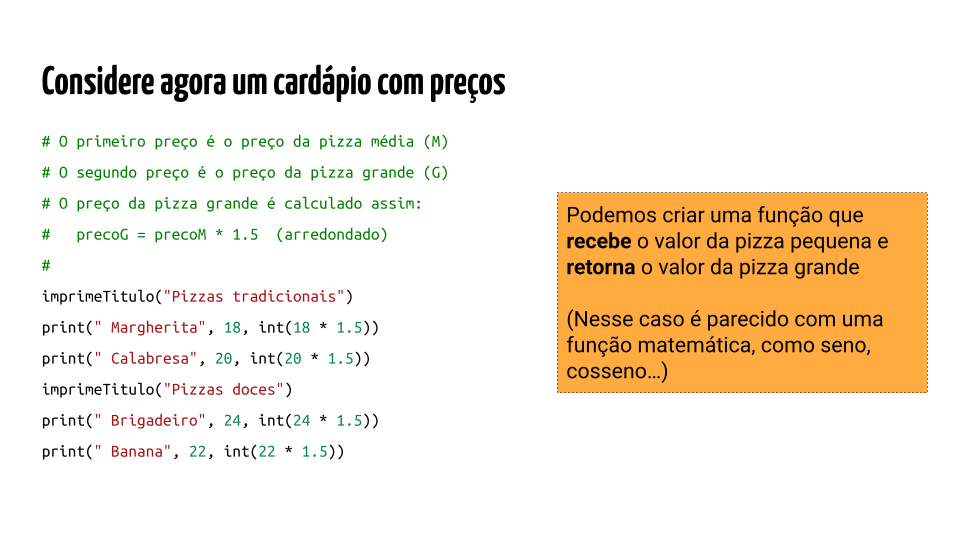

---
## Função preco_grande(preco)

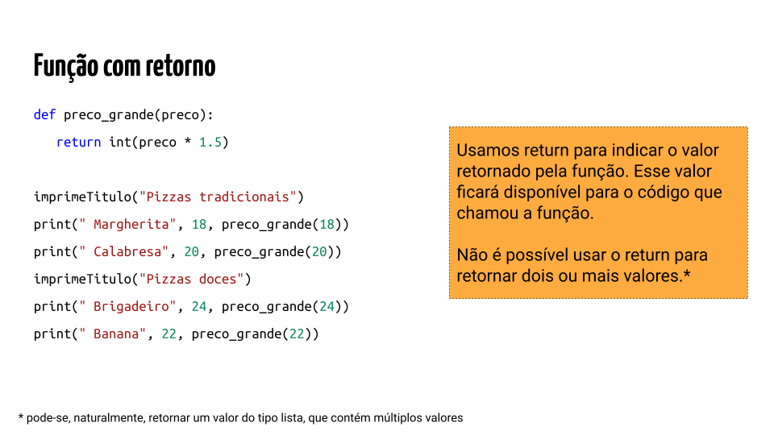

- Implemente uma função `imprimeCardapio()`

---

## Outros exemplos

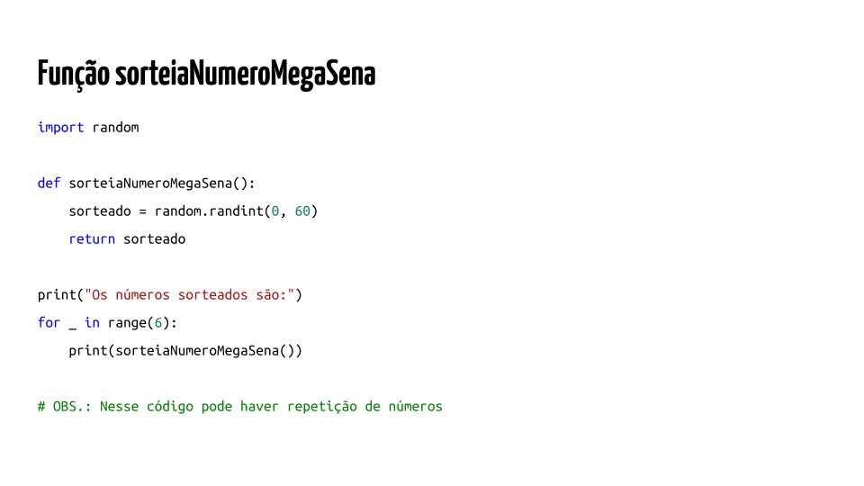

---
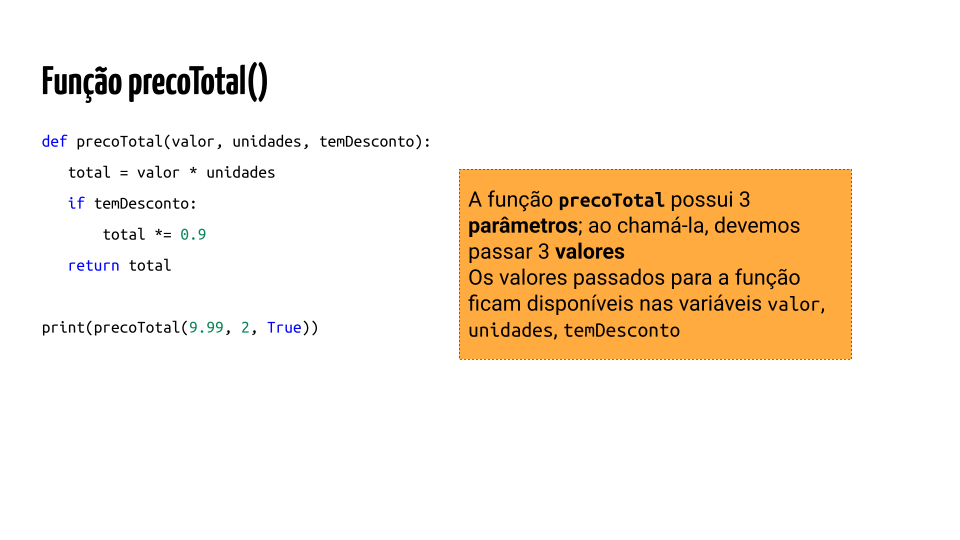

---
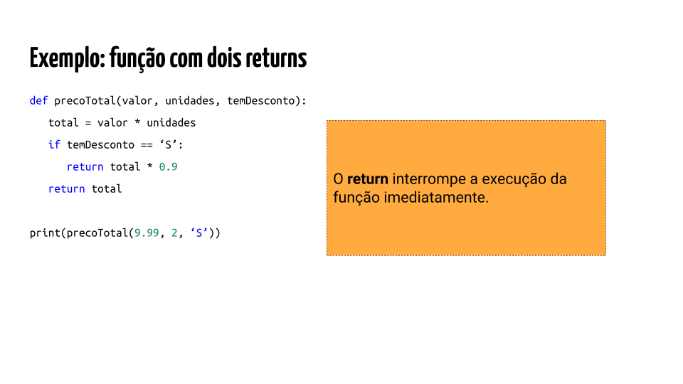

---

## Variáveis locais


`Variáveis locais` a uma função são
as variáveis definidas no corpo de tal função 
e só podem ser acessadas pelo código interno à função.

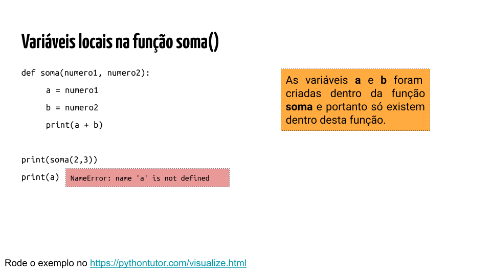

[Rode o exemplo](https://pythontutor.com/visualize.html).

---

## Variáveis globais

`Variáveis globais` de um programa são aquelas definidas fora de todas as funções.
- O valor de uma variável global pode ser acessado dentro do corpo de qualquer função.

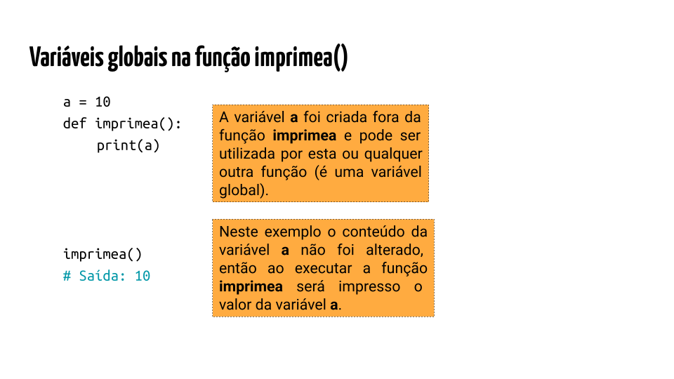

---

## Variáveis globais

O valor de uma variável global `não pode ser modificado` em uma função Python,
exceto se a mesma for declarada como `global` no corpo da função.

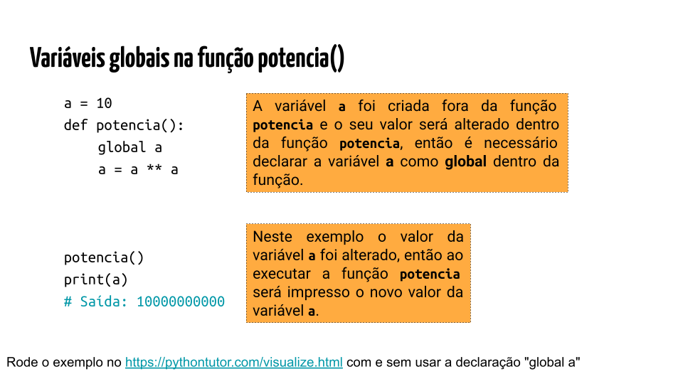

[Rode o exemplo](https://pythontutor.com/visualize.html).

---

## Variáveis globais

```python
y = 1

def teste(x):
    global y  # Declare y como uma variável global
    print(x)
    y = 20  # Agora a atribuição afeta y global
    
print(y)
teste(10) 
print(y)
```

---

## Sobre o uso de variáveis globais

Usar variáveis globais é muitas vezes considerado **má prática de programação**.

- Em geral, recomenda-se passar valores como parâmetros e receber valores como retorno da função.

Se `uma função não usa variáveis globais`, 
a chamada da função contém as informações necessárias 
para tratá-la como módulo independente e `caixa-preta` (black box).

Se `uma função usa variáveis globais`, 
é necessário conhecer melhor a função, as variáveis globais que ela usa 
e as que pode alterar.


{:/}


